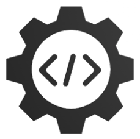

# <a name="readme-top">Springboot + Vue 前后端分离个人网站+管理后台</a>

<p >
   <a target="_blank" href="#">
      
      
      
      
      
      
      
      
      
   </a>
</p>

<!-- PROJECT LOGO -->
<br />
<div align="center">
  <a href="https://github.com/Wayne-HJ/vue-web-admin">
    
  </a>
  <h3 align="center">Springboot + Vue 前后端分离个人网站+管理后台</h3>
  <p align="center">
    本项目为vue管理后台前端
    <br />
    <!-- <a href="https://github.com/Wayne-HJ/vue-web-admin"><strong>Explore the docs »</strong></a> -->
    <!-- <br /> -->
    <br />
    <a href="https://manage.jianght.eu.org">View Demo</a>
    ·
    <a href="https://github.com/Wayne-HJ/vue-web-admin/issues">Report Bug</a>
    <!-- ·
    <a href="https://github.com/Wayne-HJ/vue-web-admin/issues">Request Feature</a> -->
  </p>
</div>

[项目介绍](#项目介绍) | [技术介绍](#技术介绍) | [运行环境](#运行环境) | [开发环境](#开发环境) | [项目截图](#项目截图) | [快速开始](#快速开始)｜[英文介绍(English)](README.md)
<!-- ABOUT THE PROJECT -->
## 项目介绍


- 项目整体采用风、宇的个人博客为基础进行二次开发。
- 采用前后端分离部署，方便开发，具有更好的扩展性和维护性。
- 网站前台参考"Hexo"的"Butterfly"设计。
- 管理后台参考"element-admin"设计：侧边栏，历史标签，自动生成面包屑导航。

**管理后台**
- 支持动态权限修改，采用RBAC模型，前端菜单和后台权限实时更新。
- 支持修改背景图片，发布文章，审核评论，发布说说，支持上传相册。
- 支持国际化，可中英切换
- 统计用户登录区域，文章浏览次数。
- 记录操作日志
- 支持博客配置，角色管理，资源管理等操作。

```
web admin:
├── assets      --  js,css,iconfont文件
├── layout      --  通用vue组件
├── locales     --  vue国际化
├── router      --  vue路由
├── store       --  vue状态管理
├── views       --  项目页面目录
```

## 技术介绍

**前端：** vue + vuex + vue-router + axios + vuetify + element + echarts

## 运行环境

**服务器：** oracle1核1G CentOS7.6

**对象存储：** minio

## 开发环境

|开发工具|说明|
|-|-|
|VSCode|Vue开发工具IDE|
|Another Redis Desktop Manager|Redis远程连接工具|
|X-shell|Linux远程连接工具|
|Xftp|Linux文件上传工具|


## 项目截图
**管理后台**


## 快速开始
本项目为vue前端
需提前启动springboot后台服务后方可运行

项目启动

```
npm install
npm run serve
```
